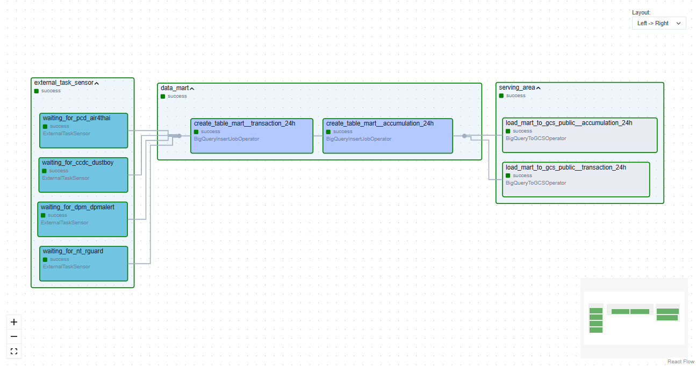

# Envilink Project

Project นี้ เป็นการสร้าง Data Pipeline สำหรับรวบรวมข้อมูลสิ่งแวดล้อมด้านมลพิษในอากาศ โดยเน้นไปที่ข้อมูลฝุ่น PM 2.5 และข้อมูลอื่นๆที่เกี่ยวข้อง ตามความต้องการของคณะกรรมการร่างกฎหมายมลพิษทางอากาศ ซึ่งชุดข้อมูลถูกจัดเก็บให้อยู่ในลักษณะไฟล์ดิจิทัล (JSON, Parquet) และอยู่ในรูปแบบโครงสร้างตารางบน Google Cloud Platform เพื่อประโยชน์ทางด้านการศึกษาและการติดตามสภาพแวดล้อมหรือปัญหาจากภัยธรรมชาติในเวลาปัจจุบัน


# Data Sources

<table>
  <tr>
    <th style="width: 30%; text-align: center;">Logo</th>
    <th style="width: 70%; text-align: center;">Source</th>
  </tr>
  <tr>
    <td><a href=""></a></td>
    <td>กรมควบคุมมลพิษ (Pollution Control Department)</td>
  </tr>
  <tr>
    <td><a href=""></a></td>
    <td>ศูนย์ข้อมูลการเปลี่ยนแปลงสภาพภูมิอากาศ มหาวิทยาลัยเชียงใหม่ (Climate Change Data Center)</td>
  </tr>
  <tr>
    <td><a href=""></a></td>
    <td>ศูนย์ข้อมูลสิ่งแวดล้อมแห่งชาติ บริษัท โทรคมนาคมแห่งชาติ จำกัด (มหาชน) (National Environmental Open Data)</td>
  </tr>
</table>


# DAGs

<a href=""> </a>

### PM 2.5 pipeline
  - **pcd_air4thai:** นำเข้าข้อมูลจาก API ของ กรมควบคุมมลพิษ (Pollution Control Department)
  - **ccdc_dustboy:** นำเข้าข้อมูลจาก API ของ ศูนย์ข้อมูลการเปลี่ยนแปลงสภาพภูมิอากาศ มหาวิทยาลัยเชียงใหม่ (Climate Change Data Center)
  - **nt_rguard:** นำเข้าข้อมูลจาก API ของ ศูนย์ข้อมูลสิ่งแวดล้อมแห่งชาติ บริษัท โทรคมนาคมแห่งชาติ จำกัด (มหาชน) (National Environmental Open Data)

### Final pipeline
  - **bq_export_csv_to_gcs:** นำข้อมูลเข้าสู่ data mart บน BigQuery จากนั้น export data ในรูปแบบของ CSV file แล้วนำไปเก็บไว้ใน GCS พร้อมทั้งเปิด link แบบสาธารณะ ทั้งนี้ทำการเชื่อมต่อ link ดังกล่าวเข้ากับระบบ ArcGIS Online เพื่อทำ dashboard แสดงค่าฝุ่น PM 2.5 แบบ near real-time

## PCD Air4Thai

<a href=""> </a>

```
...
```

## CCDC Dustboy

<a href=""> </a>

```
...
```

## NT Rguard

<a href=""> </a>

```
...
```

## Final Pipeline

<a href=""> </a>

รอให้ pipeline [pcd_air4thai, ccdc_dustboy, nt_rguard] ทำงานเสร็จ จากนั้นจึงนำข้อมูลทั้งหมดเข้าสู่ data mart บน BigQuery แล้ว export data ออกมาเก็บไว้ที่ GCS ในรูปแบบของ CSV files พร้อมทั้งเปิดการเข้าถึง files แบบสาธารณะ ทั้งนี้ได้ทำการเชื่อมต่อ public link เข้ากับระบบ ArcGIS Online เพื่อทำ dashboard แสดงค่าฝุ่น PM 2.5 แบบ near real-time
