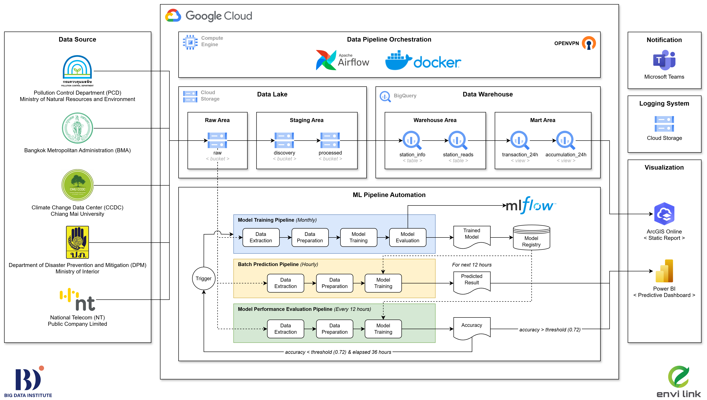

# Envilink Project

  

Project นี้ เป็นการสร้าง Data Pipeline สำหรับรวบรวมข้อมูลสิ่งแวดล้อมด้านมลพิษในอากาศ โดยเน้นไปที่ข้อมูลฝุ่น PM 2.5 และข้อมูลอื่นๆที่เกี่ยวข้อง ตามความต้องการของคณะกรรมการร่างกฎหมายมลพิษทางอากาศ ซึ่งชุดข้อมูลถูกจัดเก็บให้อยู่ในลักษณะไฟล์ดิจิทัล *JSON* และ *Parquet* รวมทั้งในรูปแบบโครงสร้างตารางบน Google Cloud Platform เพื่อประโยชน์ทางด้านการศึกษาและการติดตามสภาพแวดล้อมหรือปัญหาจากภัยธรรมชาติ ในเวลาปัจจุบัน

## Data Sources

  <table>
    <tr>
      <th style="text-align: center;">Logo</th>
      <th style="text-align: center;">Source</th>
    </tr>
    <tr>
      <td align="center">
        
      </td>
      <td align="center">
        กรมควบคุมมลพิษ กระทรวงทรัพยากรธรรมชาติและสิ่งแวดล้อม Pollution Control Department (CCDC), Ministry of Natural Resources and Environment.
      </td>
    </tr>
    <tr>
      <td align="center">
        
      </td>
      <td align="center">
        ศูนย์ข้อมูลการเปลี่ยนแปลงสภาพภูมิอากาศ มหาวิทยาลัยเชียงใหม่ Climate Change Data Center (CCDC), Chiang Mai University.
      </td>
    </tr>
    <tr>
      <td align="center">
        
      </td>
      <td align="center">
        กรมป้องกันและบรรเทาสาธารณภัย กระทรวงมหาดไทย Department of Disaster Prevention and Mitigation (DPM), Ministry of Interior.
      </td>
    </tr>
    <tr>
      <td align="center">
        
      </td>
      <td align="center">
        ศูนย์ข้อมูลสิ่งแวดล้อมแห่งชาติ บริษัท โทรคมนาคมแห่งชาติ จำกัด (มหาชน) National Environmental Open Data by National Telecom (NT) Public Company Limited.
      </td>
    </tr>
  </table>

## Data Pipeline Architecture

## Airflow DAGs

### PCD Air4Thai
กรมควบคุมมลพิษ กระทรวงทรัพยากรธรรมชาติและสิ่งแวดล้อม Pollution Control Department (CCDC), Ministry of Natural Resources and Environment.

### CCDC Dustboy
ศูนย์ข้อมูลการเปลี่ยนแปลงสภาพภูมิอากาศ มหาวิทยาลัยเชียงใหม่ Climate Change Data Center (CCDC), Chiang Mai University.

### DPM Alert
กรมป้องกันและบรรเทาสาธารณภัย กระทรวงมหาดไทย Department of Disaster Prevention and Mitigation (DPM), Ministry of Interior.

### NT Rguard
ศูนย์ข้อมูลสิ่งแวดล้อมแห่งชาติ บริษัท โทรคมนาคมแห่งชาติ จำกัด (มหาชน) National Environmental Open Data by National Telecom (NT) Public Company Limited.

## PM 2.5 pipeline

- **init_constants:** สร้างตัวแปรที่จำเป็นสำหรับ pipeline เช่น destination_file_path แยกตาม dev/prd environment เป็นต้น
- **raw_area:** นำเข้าข้อมูลจาก API และเก็บ raw data ไว้ใน GCS (raw bucket) ในรูปแบบของ *JSON* 
- **staging_area:** อ่านข้อมูล raw data จาก GCS (raw bucket) แปลงข้อมูลให้อยู่ในรูปแบบที่เหมาะสม แล้วเก็บไว้ใน GCS (discovery bucket) และ GCS (processed bucket) ในรูปแบบของ *PARQUET*
  - GCS (discovery bucket): เป็น bucket สำหรับเก็บข้อมูลที่ใกล้เคียงกับ raw data มากที่สุด สำหรับให้ data scientist นำข้อมูลไปใช้ train models หรือหา insights ต่อ
  - GCS (processed bucket): เป็น bucket สำหรับเก็บข้อมูลที่ clean เรียบร้อยแล้ว และเตรียมเข้าสู่ data warehouse
- **data_warehouse:** upload ข้อมูลจาก GCS (processed bucket) เข้าสู่ BiqQuery (temp table) จากนั้น upsert ข้อมูลจาก BiqQuery (temp table) เข้าสู่ BiqQuery (station_info table) และ BiqQuery (station_reads table) ด้วยวิธี *Slowly Changing Dimension (SCD) Type 2*
  - BiqQuery (station_info table): เป็น table สำหรับเก็บข้อมูลทั่วไปของสถานีวัดค่าฝุ่น เช่น owner, staion_id, station_name, latitude, longitude, และ address เป็นต้น เปรียบเสมือน master table
  - BiqQuery (station_reads table): เป็น table สำหรับเก็บข้อมูล transaction ของค่าฝุ่น PM 2.5 จากแต่ละสถานีวัดค่าฝุ่นของแต่ละหน่วยงานผู้ให้บริการ APIs

### bq_export_csv_to_gcs

## Final Pipeline
- **external_task_sensor:** sensor รอให้ pipeline [ pcd_air4thai, ccdc_dustboy, dpm_dpmleart, nt_rguard ] เพียงอันใดอันหนึ่งมีสถานะเป็น `success` จึงจะอนุญาตให้ downstream tasks ทำงานต่อ
- **data_mart:** นำข้อมูลทั้งหมดเข้าสู่ data mart บน BigQuery
  - BiqQuery (transaction_24h view): เป็นข้อมูล transaction ของค่าฝุ่น PM 2.5 จากแต่ละสถานีวัดค่าฝุ่นของแต่ละหน่วยงานผู้ให้บริการ APIs ล่าสุด 24 ชั่วโมง
  - BiqQuery (accumulation_24h view): เป็นข้อมูล สรุปผลค่าฝุ่น PM 2.5 จากแต่ละสถานีวัดค่าฝุ่นของแต่ละหน่วยงานผู้ให้บริการ APIs แยกตาม color_id
- **serving_area:** export data ออกมาเก็บไว้ที่ GCS (public bucket) ในรูปแบบของ CSV files พร้อมทั้งเปิดการเข้าถึง files แบบสาธารณะ ทั้งนี้ได้ทำการเชื่อมต่อ public link เข้ากับระบบ ArcGIS Online เพื่อสร้าง dashboard แสดงค่าฝุ่น PM 2.5 ตามพิกัดของสถานีต่างๆ บนแผนที่ประเทศไทย

## Dashboard
แสดงคุณภาพอากาศตามปริมาณฝุ่น PM 2.5 ในชั้นบรรยากาศ ที่ได้จาก sensor ของสถานีตรวจวัดอากาศของแต่ละหน่วยงานผู้ให้บริการ APIs เพื่อให้ผู้ใช้งานสามารถติดตามสถานการณ์ฝุ่นในระดับอำเภอและจังหวัด ตลอด 24 ชั่วโมง

