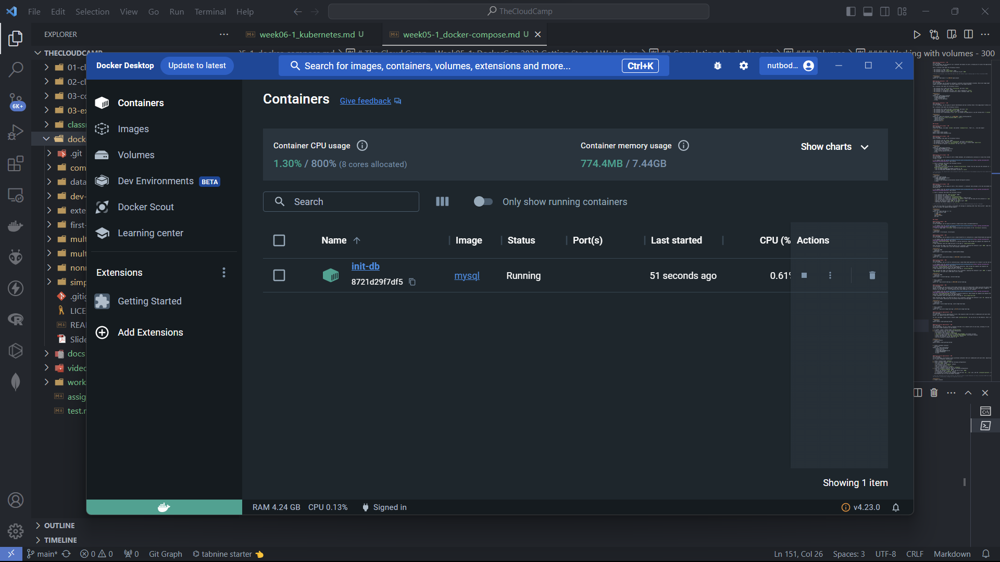

# Assignment-3: Containerization Workshop
NutBodyslam053@TCC231019

---
## DockerCon 2023 Getting Started Workshop
https://github.com/mikesir87/dockercon23-workshop-materials
### Installing the extension
```bash
docker extension install mikesir87/dockercon23-extension
```
After a moment, you should see the extension appear in the left-hand navigation menu of the Docker Desktop.

---

## Containers

### Running containers - 100
Your challenge
In this challenge, we're going to run a simple container.

Start a container named `hello-world` that uses the `hello-world` image

**Solution:**
```powershell
docker run --name hello-world hello-world
```


### Running containers - 200
Your challenge
In this challenge, you're going to create a container with a few additional flags and override the default command.

Start a container that meets the following criteria:

- The container has the name of `timer`
- The container uses the `ubuntu` image
- The container is configured to `run interactively`
- The container is configured to `automatically be removed` when it exits
- The container does not run the default command, but `sleep 30`

> Note that since the container will automatically remove itself, you need to run the verifier before it exits. Since it's sleeping for 30 seconds, you should have plenty of time.

**Solution:**
```powershell
docker run --name timer -it --rm ubuntu sleep 30
```


### Running containers - 300
Your challenge
In this challenge, you are going to run a container and expose its ports, allowing you to access the application it's running in your browser.

Start a container that meets the following criteria:

- The container is named `nginx`
- The container uses the `nginx:alpine` image
- The container exposes its port `80` on the host at port `8080`

> If you're successful, you should be able to see the default nginx landing page at http://localhost:8080.

**Solution:**
```powershell
docker run --name nginx -d -p 8080:80 nginx:alpine
```


Nginx:


### Running containers - 400
Your challenge
In this challenge, you are going to configure a container using environment variables. While each image might support different configuration, the mysql image has a few unique features.

Run a container that meets the following criteria:

- The container has a label with key `training.app` and value `mysql`
- The container uses the `mysql` image
- The container is configured to set the `root` user's password to `secret`
- The container is configured to automatically create a database named `app`

**Solution:**
```powershell
docker run --name mysql-container `
  -e MYSQL_ROOT_PASSWORD=secret `
  -e MYSQL_DATABASE=app `
  --label training.app=mysql `
  -d mysql
```


### Running containers - 500
Your challenge
In this challenge, you are going to explore healthchecks and how to define them if the image doesn't define its own.

Run a container that meets the following criteria:

- The container has a label with key `training.app` and value `cats`
- The container uses the `mikesir87/cats:1.0` image
- The container exposes its port `5000` on the host at port `5050`
- The container has a healthcheck to use `curl` to validate the application is up and running every `5 seconds`

**Solution:**
```powershell
docker run --name cats-container -d -p 5050:5000 --label training.app=cats `
  --health-cmd="curl -f http://localhost:5000/ || exit 1" `
  --health-interval=5s `
  --health-retries=3 `
  mikesir87/cats:1.0
```


## Volumes

### Working with volumes - 100
Your challenge
Create two volumes, one named `volume1` and another `database-files`. That's it... nice and simple!

**Solution:**
```powershell
docker volume create volume1
docker volume create database-files
```


### Working with volumes - 200
Your challenge
Start a container that meets the following criteria:

- The container uses the `mysql` image
- The container has a label with key `training.app` and value `persistent-db`
- The database's files (found at `/var/lib/mysql`) are stored in a volume named `mysql-files`
- You are welcome to specify `any password` for the `root` user.

**Solution:**
```powershell
docker run --name mysql-container `
  -e MYSQL_ROOT_PASSWORD=your_password `
  -v mysql-files:/var/lib/mysql `
  --label training.app=persistent-db `
  -d mysql
```


Volumes:


### Working with volumes - 300
Your challenge
In this challenge, you are going to start a MySQL database, but automatically initialize it using files shared through a volume.

1. (If needed) Clone the [github.com/mikesir87/dockercon23-workshop-materials](https://github.com/mikesir87/dockercon23-workshop-materials) repo locally

2. Start a container that meets the following criteria:
   - Uses the `mysql` image
   - Has a name of `init-db`
   - Specifies a bind mount sharing the `database-initialization` folder from the repo with the container at `/docker-entrypoint-initdb.d`
   - Sets the MYSQL_DATABASE environment variable to `db`
   - Sets the MYSQL_ROOT_PASSWORD environment variable to `secret`

> If successful, you should have a new container start that initializes the database using the files shared through the bind mount!

**Solution:**
```powershell
docker run --name init-db `
   -e MYSQL_ROOT_PASSWORD=secret `
   -e MYSQL_DATABASE=db `
   -v database-initialization:/docker-entrypoint-initdb.d `
   -d mysql
```


Volumes:


### Working with volumes - 500
Your challenge
In this challenge, you are going to start a "dev container", a container that provides a full dev environment for a Node-based API.

1. (If needed) Clone the [github.com/mikesir87/dockercon23-workshop-materials](https://github.com/mikesir87/dockercon23-workshop-materials) repo locally

2. Start a container that meets the following criteria:

   - The container uses the `node:lts-alpine` image
   - The container has a name of `node-app`
   - The container is configured to `run interactively`
   - The container is configured to `automatically remove` itself on exit
   - The container has a bind mount connecting `dev-express` folder from the repo into the container at `/app`
   - Sets the container's working directory to `/app`
   - Exposes the container's port `3000` on the host at port `3000`
   - Overrides the default command to run `yarn dev`

> If successful, you should be able to open http://localhost:3000/api/message and get a message!

3. Open the file found at src/index.js and modify the message to something other than "Hello world!". Open the site again and validate the updated message appears.

**Solution:**
```powershell
docker run --name node-app -it --rm `
   -v .\dev-express\:/app `
   -w /app `
   -p 3000:3000 `
   node:lts-alpine `
   yarn dev
```


Application:


## Docker/Images

### Building Docker/images - 100
Your challenge
In this challenge, you are going to perform a simple build using a provided Dockerfile.

1. (If needed) Clone the [github.com/mikesir87/dockercon23-workshop-materials](https://github.com/mikesir87/dockercon23-workshop-materials) repo locally
2. Create an image named `first-build` using the Dockerfile and contents of the `first-build` directory.

**Solution:**
```powershell
docker build -t first-build .\first-build\
```


### Building Docker/images - 200
Your challenge
In this challenge, you are going to write a simple Dockerfile to containerize a simple Python-based web application.

1. (If needed) Clone the [github.com/mikesir87/dockercon23-workshop-materials](https://github.com/mikesir87/dockercon23-workshop-materials) repo locally
2. In the `simple-python-webapp` directory is a partial Dockerfile. Read through the comments and complete the Dockerfile.
3. When completed, build the image and give it the name of `simple-python-webapp`

After building the image, you should be able to run a container, exposing the container's port `5000`. Open the app in the browser, you should see a site that displays randomized memes.

**Solution:**
1. Build the image
```powershell
docker build -t simple-python-webapp .\simple-python-webapp\
```


2. Run a container
```powershell
docker run --name simple-python-webapp -p 5000:5000 simple-python-webapp
```


### Building Docker/images - 300
Your challenge
In this challenge, you will work on containerizing a simple Node based application so it doesn't use the root user.

1. (If needed) Clone the [github.com/mikesir87/dockercon23-workshop-materials](https://github.com/mikesir87/dockercon23-workshop-materials) repo locally
2. In the `nonroot-node-app` directory is a partial Dockerfile. Read through the comments and complete the Dockerfile, looking specifically at the TODO comments.
3. When completed, build the image and give it the name of `nonroot-node-app`.

After building the image, you should be able to run a container, exposing the container's port `3000`. A request to `/api/message` will give you a JSON object with a message.

**Solution:**
1. Build the image
```powershell
docker build -t nonroot-node-app .\nonroot-node-app\
```


2. Run a container
```powershell
docker run --name nonroot-node-app -p 3000:3000 nonroot-node-app
```


### Building Docker/images - 400
Your challenge
In this challenge, you will build a multi-stage container where one stage builds a React app and the second stage deploys it using nginx. The advantage is that your final image is very small and ships only what's needed to actually run your app (yes... we're ignoring server-side rendering in this example).

1. (If needed) Clone the [github.com/mikesir87/dockercon23-workshop-materials](https://github.com/mikesir87/dockercon23-workshop-materials) repo locally
2. In the `multi-stage-react-app` directory is a partial Dockerfile. Read through the comments and complete the Dockerfile, looking specifically at the TODO comments.
3. When completed, build the image and give it the name of `multi-stage-react-app`.

After building the image, you should be able to run a container, exposing the container's port `80`. Opening the site in your browser should give you the default React/Vite starting page.

**Solution:**
1. Build the image
```powershell
docker build -t multi-stage-react-app .\multi-stage-react-app\
```


2. Run a container
```powershell
docker run --name multi-stage-react-app -p 80:80 multi-stage-react-app
```


### Multi-service applications - 100
Your challenge
In order for multi-service applications to work, they typically need to be able to communicate with each other. With Docker, this requires the use of networks.

For this challenge, simply create a network named `getting-started`. You can use all of the defaults. That's it!

**Solution:**
```powershell
docker network create getting-started
```


### Multi-service applications - 200
Your challenge
In this challenge, you will create a container and add it to a network with its own alias, allowing it to be discovered by other containers on the network.

1. If needed, create a network named `getting-started`
2. Create a container with the following configuration:
   - A container using the `mysql` image
   - The container has a name of `networked-db`
   - `Any value` can be provided for the `MYSQL_ROOT_PASSWORD` environment variable
   - Create a database with `any name` using the `MYSQL_DATABASE` environment variable
   - Connect the container to the `getting-started` network
   - Give the container a network alias of `db`

**Solution:**
```powershell
docker run --name networked-db `
    --network getting-started `
    --network-alias db `
    -e MYSQL_ROOT_PASSWORD=secret `
    -e MYSQL_DATABASE=db `
    -d mysql
```


### Multi-service applications - 300
Your challenge
In this challenge, we are going to spin up multiple containers that will communicate with each other. Specifically, we'll launch a Wordpress installation!

1. Create a network named `wordpress`
2. Create a database container with the following configuration:
   - Uses the `mysql` image
   - Is connected to the `wordpress` network
   - Uses a network alias of `db`
   - Sets the root password to `secret`
   - Creates a database using the name of `wordpress`
3. Create the wordpress container using the following configuration:
   - Uses the `wordpress:6-apache` image
   - Exposes the container's port `80` on the host at port `8080`
   - Is connected to the `wordpress` network
   - Is configured to connect to the database using the host `db`, `root` user, and the `configured password`. See the Wordpress docs for the environment variables

> Once the containers are up and running, you should be able to open Wordpress at http://localhost:8080 and complete the Wordpress installation (though not required to do so).

**Solution:**
1. Create a network
```powershell
docker network create wordpress
```


2. Create a database container
```powershell
docker run --name wordpress-db `
    --network wordpress `
    --network-alias db `
    -e MYSQL_ROOT_PASSWORD=secret `
    -e MYSQL_DATABASE=wordpress `
    -d mysql
```

3. Create the wordpress container
```powershell
docker run --name wordpress-site `
    --network wordpress `
    -p 8080:80 `
    -e WORDPRESS_DB_HOST=db `
    -e WORDPRESS_DB_USER=root `
    -e WORDPRESS_DB_PASSWORD=secret `
    -d wordpress:6-apache
```


Wordpress:


### Multi-service applications - 500
Your challenge
In this challenge, you are going to use multiple Compose files, more in a deployment setup.

In this scenario, you have a single proxy (provided by Traefik) that will forward requests to other applications. However, the other applications aren't working for some reason.

Your job is to figure out what's going on and fix it! A couple of notes:

- (If needed) Clone the [github.com/mikesir87/dockercon23-workshop-materials](https://github.com/mikesir87/dockercon23-workshop-materials) repo locally
- All of the Compose files are in the `multi-deploy-compose` directory
- You are NOT allowed to make any changes to the proxy Compose file. `Only change the individual app` projects.
- Read the comments in the files for additional help
- Each of the Compose files need to be deployed on their own (no multi-file deploy, etc.)

After completion, you should be able to access cats.localhost, dogs.localhost, and whales.localhost to access three separate applications.

**Solution:**
```powershell
docker-compose -f .\multi-deploy-compose\app-cats\compose.yaml `
    -f .\multi-deploy-compose\app-dogs\compose.yaml `
    -f .\multi-deploy-compose\proxy\compose.yaml up -d
```


Cats-app:


Dogs-app:


Whales-app:


Traefik:


### Multi-service applications - 600
Your challenge
In this challenge, you are going to populate a Compose file to support a development environment. Once completed, you should be able to docker compose up and start development right away!

1. (If needed) Clone the [github.com/mikesir87/dockercon23-workshop-materials](https://github.com/mikesir87/dockercon23-workshop-materials) repo locally
2. The `compose-project` contains a compose.yaml file with the skeleton of a Compose stack. Complete the Compose file using the hints specified.
3. When completed, spin up the Compose project by running docker compose up while in the directory.

After it's up and running, you should be able to open http://localhost:3000 and see the application up and running!

**Solution:**
```powershell
docker-compose -f .\compose-project\compose.yaml up -d
```


Application:
