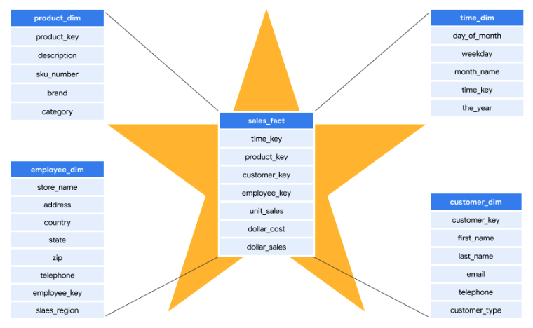
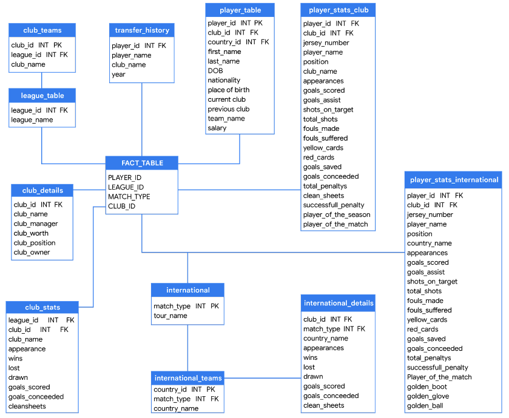
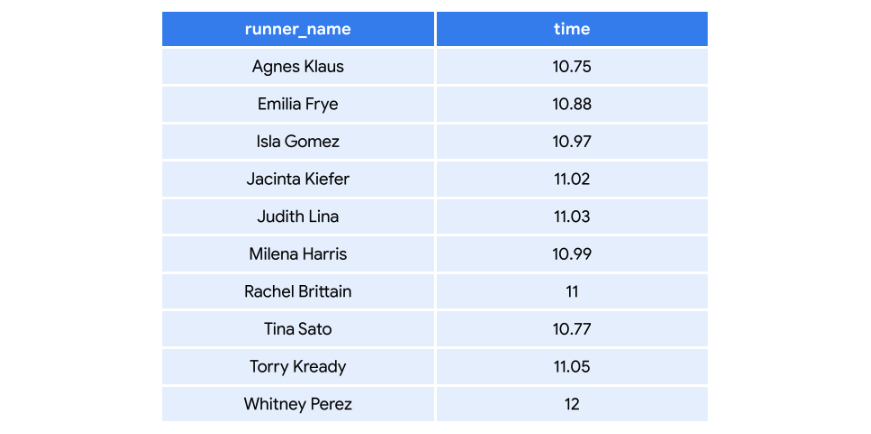

# DP-900
---
## Data Loading
- ETL
- ELT

## Type of Data
- Structured data
- Semi-structured data
- Unstructured data

## Data Storage Characteristics
- Relational data storage
- Non-relational dta storage

## Transactional VS analytical data stores
### OLAP
Online Analytical Processing (OLAP) systems are databases that have been primarily optimized for analysis.
#### Use
- Provide user access to data from a variety of source systems
- Used by BI and other data professionals to support decision-making processes
- Analyze data from multiple databases
- Draw actionable insights from data delivered to reporting tables
### OLTP
- Online Transaction Processing (OLTP) systems are databases that have been optimized for data processing instead of analysis.
#### Use
- Store transaction data
- Used by customer-facing employees or customer self-service applications
- Read, write, and update single rows of data
- Act as source systems that data pipelines can be pulled from for analysis
        
## Analytical system
> Data ingestion -> Data storage -> Data processing -> Data visualization

## Data ingestion
- Batch
- Streaming

## Types of non-relational data
- JSON
- AVRO
- ORC
- Parquet

## Types of NoSQL
- Key-value stores
- Document based
- Column family databases
- Graph databases

## Explore data analytics
- Descriptive
- Diagnostic
- Predictive
- Descriptive
- Cognitive

## Types of Schemas
- Star schema

- Snowflex schema

- Flat model

- Semi-structured schemas
- Document schemas
- Key-value schemas
- Wide-column schemas
- Graph schemas