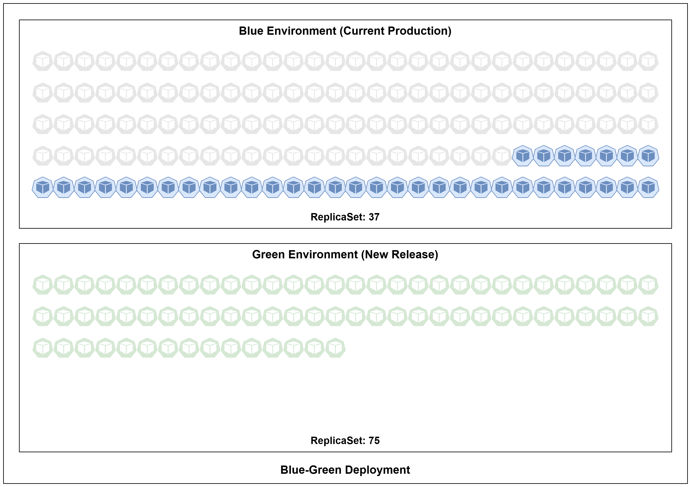
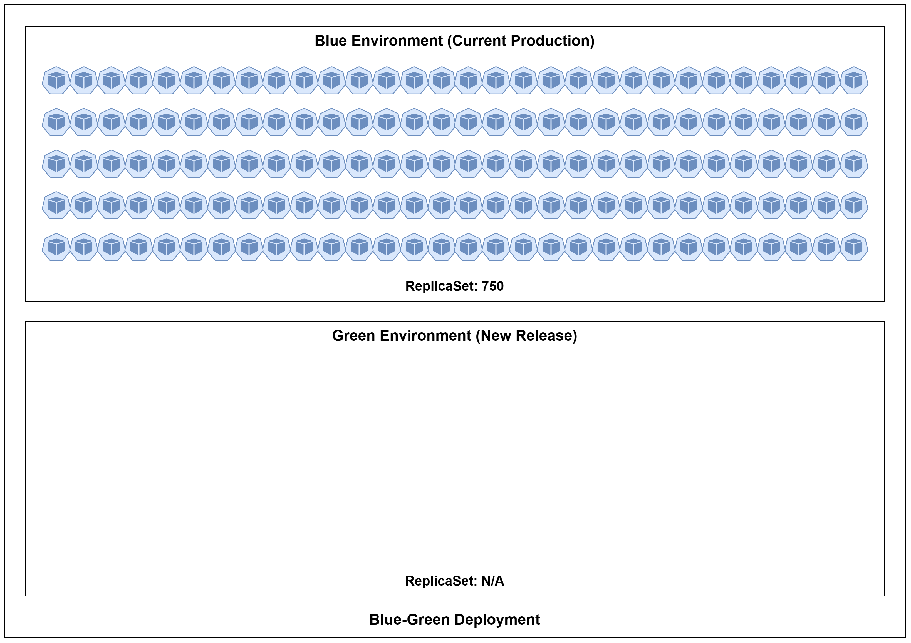

# Assignment-4: Kubernetes Fundamental
NutBodyslam053@TCC231019

## Kubernetes Overview


## Kubernetes Architecture


---

## Kubernetes system flow
```
$ kubectl get pod nong-kai
```


### Breakdown of the process:

1. **Client**: The user executes the `kubectl` command from their terminal or command-line interface to interact with the Kubernetes cluster.

2. **Control Plane (API Server)**: The `kubectl` command sends the request to the Kubernetes `API server`, which is the entry point for managing the cluster. The API server authenticates and authorizes the request.

3. **Control Plane (etcd Datastore)**: The `API server` communicates with the `etcd data store` to retrieve the information about the pod named "nong-kai." Etcd stores the cluster's configuration and state information.

4. **Control Plane (Controller Manager)**: The `Controller Manager` continuously monitors the state of the cluster but is `not directly involved in a read operation` like "get." However, it ensures that the desired state is maintained.

5. **Control Plane (Scheduler)**: The `Scheduler` is `not directly involved in a "get" operation`. It is responsible for selecting an appropriate node for a new pod when a pod needs to be scheduled.

6. **Node (kubelet)**: The `kubelet` on the node where the pod "nong-kai" is running is `not directly involved in a "get" operation`. It mainly manages the containers on the node, ensuring that they are running as expected.

7. **Node (Container Runtime)**: The `Container Runtime` (e.g., Docker, containerd) running on the node is `not directly involved in a "get" operation`. It's responsible for managing containers but is not actively engaged in the "get" request.

In summary, when you execute the `kubectl get pod nong-kai` command, the primary interactions occur between the client and the Control Plane components, with the `API server` fetching the pod information from the `etcd data store`. The other components like the `Controller Manager`, `Scheduler`, `kubelet`, and `Container Runtime` are not directly involved in this read operation.

```
$ kubectl delete pod nong-kai
```


### Breakdown of the process:

1. **Client**: The user executes the `kubectl` command from their terminal or command line interface to interact with the Kubernetes cluster.

2. **Control Plane (API Server)**: The `kubectl` command sends the request to the Kubernetes `API server`, which is the entry point for managing the cluster. The API server authenticates and authorizes the request.

3. **Control Plane (etcd Datastore)**: The `API server` communicates with the `etcd data store` to persist the state of the cluster. In this case, it retrieves the information about the pod named "nong-kai."

4. **Control Plane (Controller Manager)**: The `Controller Manager` continuously monitors the state of the cluster and ensures that the desired state is maintained. In this case, it may notice that the pod "nong-kai" is not in the desired state (i.e., it should be deleted).

5. **Control Plane (Scheduler)**: The `Scheduler` is responsible for selecting an appropriate node for a new pod if the pod needs to be rescheduled. In this case, it's `not directly involved since the pod is being deleted`.

6. **Node (kubelet)**: The `kubelet` on the node where the pod "nong-kai" is running receives the deletion request from the Control Plane. The kubelet is responsible for managing the containers on the node. It will gracefully shut down the containers in the pod if necessary.

7. **Node (Container Runtime)**: The `Container Runtime` (e.g., Docker, containerd) running on the node is responsible for stopping and removing the containers associated with the pod "nong-kai."

So, when you execute the `kubectl delete pod nong-kai` command, it initiates a cascade of communication and actions across various components of the Kubernetes cluster, resulting in the graceful termination of the specified pod.

---

## Deployment Strategy

```bash
- ReplicaSet: 150
- maxUnavilable: 75%
- MaxSurge: 50% 
```

### How the deployment process works

1. **Initial State**: The deployment begins with the `application or service running with 150 pods in the cluster`, consisting of both old and new versions.


2. **Intermediate State**: During the deployment, Kubernetes scales down the old version by adhering to the "maxUnavailable" setting, aiming to minimize downtime. It simultaneously scales up the new version based on the "MaxSurge" setting to ensure a smooth transition.
   
   - **Scaling Down (maxUnavailable)**: During the deployment, Kubernetes will try to scale down the old version (150 pods) by taking into account the "maxUnavailable" setting. In this case, `"maxUnavailable" is set to 75%`, which means Kubernetes can `take down up to 75% of the old pods`, or 112.5 pods. However, Kubernetes doesn't deal with fractional pods, so it will round up to the nearest integer, resulting in `113 pods being taken down`.

   - **Scaling Up (MaxSurge)**: `At the same time`, Kubernetes will start scaling up the new version of your application. `"MaxSurge" is set to 50%`, which means it can `add up to 50% more pods to the new version` compared to the old version. In this case, it can `add 75 pods (50% of 150)`.
   


3. **Final State**: The deployment `process continues until all old pods have been replaced with new pods`. The deployment is `considered complete when 150 pods, all running the new version`, are in operation, and there are no old pods remaining.


```bash
- ReplicaSet: 750
- maxUnavilable: 0%
- MaxSurge: 100% 
```

### How the deployment process works

1. **Initial State**: The deployment commences with the `application or service running with 750 pods in the cluster`, representing both the old and new versions.
   


2. **Intermediate State**: Kubernetes employs a "maxUnavailable" setting of 0%, ensuring that no old pods are taken down simultaneously. This keeps the old version running without interruption. Concurrently, the "MaxSurge" setting is 100%, allowing Kubernetes to double the number of pods by adding 750 new pods, resulting in both old and new versions running in parallel.

   - **Scaling Down (maxUnavailable)**: In this case, `"maxUnavailable" is set to 0%`, which means Kubernetes `won't allow any old pods to be taken down simultaneously`. This setting ensures that the old version of the application continues to run without any interruption during the deployment.

   - **Scaling Up (MaxSurge)**: At the same time, Kubernetes will start scaling up the new version. `"MaxSurge" is set to 100%`, which means it can `add up to 100% more pods to the new version` compared to the old version. In this case, it can `add 750 pods`, effectively doubling the number of pods for the new version.


3. **Final State**: Over time, Kubernetes will `gradually scale down the old pods and scale up the new pods`. The deployment is `considered complete when all 750 pods are running the new version`, and there are no old pods left.


---