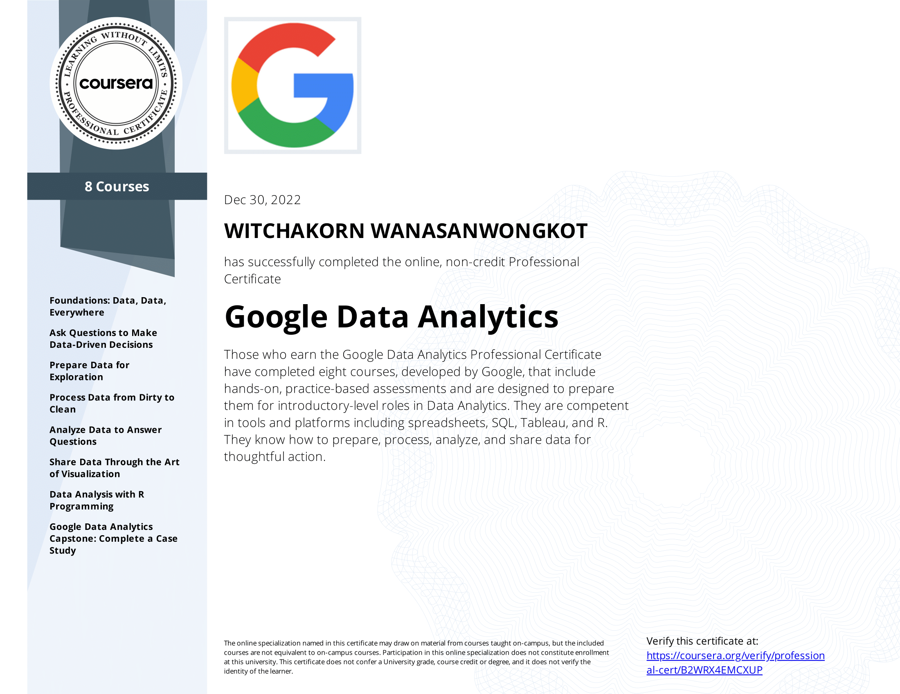
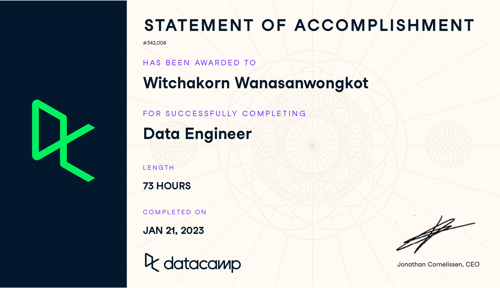

<h1 align="center">Hi 👋, My name is Witchakorn Wanasanwongkot</h1>

<h3 align="left">About</h3>

Master's student in Big Data Engineering with a track record in data exploration, cleansing, transformation, and visualization. Skilled in Python automation and experienced in collaborating with data scientists and supporting data-driven decision making. Seeking a role to leverage skills and drive positive impact through data analysis.

- 🧠 I’m currently learning **Data Science, Data Engineering, and Japanese.**

- 👨‍💻 **My Data Analytics Projects:**
    -  SQL:
        - [SQLite :: *Chinook*](https://github.com/NutBodyslam053/NutBodyslam053/blob/main/SQL/sqlite-chinook.ipynb)
        - [MySQL :: *Sakila*](https://github.com/NutBodyslam053/NutBodyslam053/blob/main/SQL/mysql-sakila.ipynb)
    -  Python:
        - [Sales Data Analytics for Motorcycle Report](https://github.com/NutBodyslam053/NutBodyslam053/blob/main/Python/reporting_on_sale_data.ipynb)
        - [Google Trends Analytics for Smartphone Report :: [ *Google Trends -> Google Sheets -> Looker* ]](https://github.com/NutBodyslam053/NutBodyslam053/blob/main/Automation/GoogleTrands/GoogleTrends-smartphone.ipynb)
    -  Automation:
        - [Python Automation Tasks](https://github.com/NutBodyslam053/NutBodyslam053/blob/main/Automation/AutomationTasks/automation_tasks.ipynb)
    - Looker:
        - [Generating a report by connecting data from *GoogleSheets*](https://lookerstudio.google.com/u/0/reporting/743d4b2c-484f-4a25-8559-ce61c9318bf4/page/dlwOD)
        - [Generating a report by connecting data from *BigQuery*](https://lookerstudio.google.com/reporting/5b79a5f1-8678-4b13-9cd2-f43c39f2ef75)

- 👨‍🔬 **My Data Science Projects:**
    -  Machine Learning:
        -  [Linear Regression :: *Car Price Prediction*](https://github.com/NutBodyslam053/MLzoomcamp/blob/main/01-LinearRegression/01-carprice.ipynb)
        -  [Logistic Regression :: *Customer Churn Prediction*](https://github.com/NutBodyslam053/MLzoomcamp/blob/main/02-LogisticRegression/02-churn.ipynb)
        -  [Classification Tree :: *Credit Scoring*](https://github.com/NutBodyslam053/MLzoomcamp/blob/main/03-ClassificationTree/03-credit_scoring.ipynb)
    -  Deep Learning:
        -  [CNN :: *Image Classification*](https://github.com/NutBodyslam053/MLzoomcamp/blob/main/04-DeepLearning/04-DeepLearning.ipynb)

- 👷‍♂️ **My Data Engineering Projects:**
    - Docker:
        - [Ingesting data into a PostgreSQL database running on Docker :: [ *Web -> PostgreSQL* ]](https://github.com/NutBodyslam053/DEzoomcamp/blob/main/2_docker_sql/ingest-data.py)
    - Prefect:
        - [Ingesting data into a PostgreSQL database running on Local :: [ *Web -> PostgreSQL* ]](https://github.com/NutBodyslam053/DEzoomcamp/blob/main/3_prefect_gcp/01_start/ingest-data-prefect.py)
        - [ETL workflow :: [ *Web -> Local -> Google Cloud Storage -> BigQuery* ]](https://github.com/NutBodyslam053/DEzoomcamp/blob/main/3_prefect_gcp/02_gcp/etl-web_to_gcs_to_bg.py)
        - [Parameterizing Flow & Deployments](https://github.com/NutBodyslam053/DEzoomcamp/blob/main/3_prefect_gcp/03_deployments/parameterized_flow.py)
    - Airflow:
        - [ETL workflow :: [ *Database, Web -> Google Cloud Storage -> BigQuery* ]](https://github.com/NutBodyslam053/NutBodyslam053/blob/main/Airflow/start_ws5_gcs_to_bq.py)
    - Spark:
        - [Manipulating data with *PySpark*](https://github.com/NutBodyslam053/NutBodyslam053/blob/main/Spark/PySpark.ipynb)

<h3 align="left">Languages and Tools:</h3>

- **Programming Languages:**

    <!-- 
    
    
    
    
    
     -->

    
    
    
    
    
    
    
    

- **Database Management Systems:**

    
    
    <!--  -->
    <!--  -->
    

- **Data Visualization Tools:**

    
    
    
    <!--  -->

- **Big Data Processing Frameworks:**

    
    <!--  -->
    

- **Containerization & Orchestration Tools:**
    
    
    
    

- **Cloud Platforms:** 

    <!--  -->
    
    <!--  -->
    
    <!--  -->

- **IDE & Version Control Tools:** 

     
     
     
    
    <!--  -->
    
     
    

<h3 align="left">Licenses & certifications:</h3>

- **Microsoft:**

    
    
    
    

- **HackerRank:**

    
    
    

- **Coursera:**

    
    

- **DataCamp:**

    

- **JLPT:**

    
