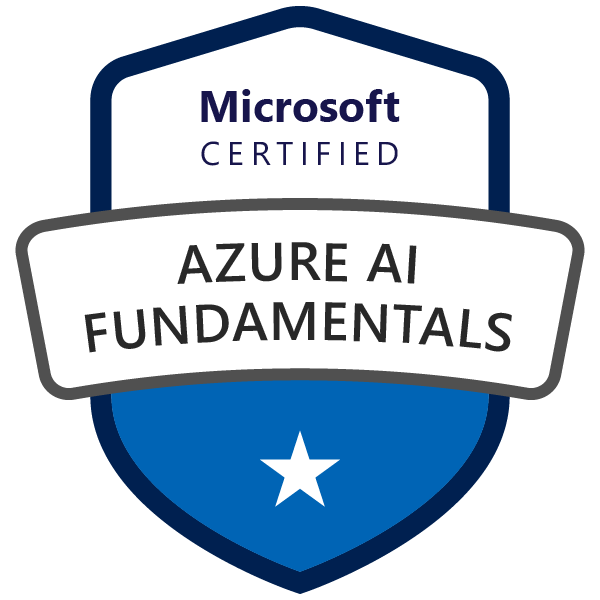
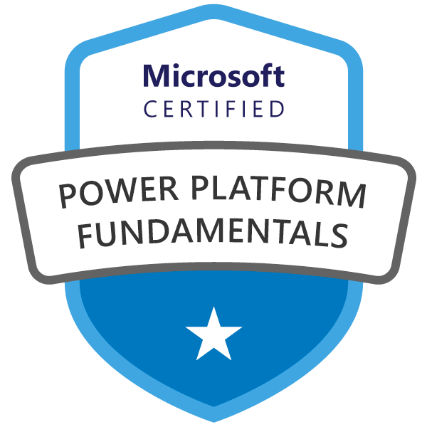

<h1 align="center">  <i>Hello, Universe!   It's <b>NutBodyslam</b> right here!!!</i>  </h1>

<!-- <h1 align="center"> 🌏 <i>Hello, Universe! 🚀 It's <b>NutBodyslam</b> right here!!!</i> 👎🏻</h1> -->

<h2 align="left">About</h2>

Data Engineer with a proven ability to design, build, and maintain scalable data pipelines and architectures. Skilled in Python, SQL, Docker, BigQuery, and Apache Airflow. Experienced in collaborating with Data Scientists and supporting data-driven decision making. Seeking a role to leverage my skills and drive positive impact through Data Analytics.

<h2 align="left">Projects</h2>

### 👨🏻‍💻 **My Data Analytics Projects**
-  **Database**:
    - [SQLite :: *Chinook*](https://github.com/NutBodyslam053/NutBodyslam053/blob/main/SQL/sqlite-chinook.ipynb)
    - [MySQL :: *Sakila*](https://github.com/NutBodyslam053/NutBodyslam053/blob/main/SQL/mysql-sakila.ipynb)
    - [MongoDB :: *IMDb*](https://github.com/NutBodyslam053/NutBodyslam053/blob/main/MongoDB/mongodb.ipynb)
-  **Programing Language**:
    - [Python :: Sales Data Analytics for Motorcycle Report](https://github.com/NutBodyslam053/NutBodyslam053/blob/main/Python/reporting_on_sale_data.ipynb)
    - [Python :: Google Trends Analytics for Smartphone Report :: [ *Google Trends → Google Sheets → Looker* ]](https://github.com/NutBodyslam053/NutBodyslam053/blob/main/Automation/GoogleTrands/GoogleTrends-smartphone.ipynb)
-  **Automation**:
    - [Python Automation Tasks](https://github.com/NutBodyslam053/NutBodyslam053/blob/main/Automation/AutomationTasks/automation_tasks.ipynb)
    - [Web Scraping :: Scraping Job Postings with *BeautifulSoup*](https://github.com/NutBodyslam053/NutBodyslam053/blob/main/Automation/WebScraping/web_scraping-beautiful_soup.ipynb)
    - [Web Scraping :: Scraping Football Betting Statistics with *Selenium*](https://github.com/NutBodyslam053/NutBodyslam053/blob/main/Automation/WebScraping/web_scraping-selenium.ipynb)
    - [Web Scraping :: Scraping the 2022 FIFA World Cup Data with *Pandas*](https://github.com/NutBodyslam053/NutBodyslam053/blob/main/Automation/WebScraping/web_scraping-pandas.ipynb)
- **Visualization**:
    - [Looker :: Generating a report by connecting data from *GoogleSheets*](https://lookerstudio.google.com/u/0/reporting/743d4b2c-484f-4a25-8559-ce61c9318bf4/page/dlwOD)
    - [Looker :: Generating a report by connecting data from *BigQuery*](https://lookerstudio.google.com/reporting/5b79a5f1-8678-4b13-9cd2-f43c39f2ef75)

### 👨🏻‍🔬 **My Data Science Projects**
-  **Machine Learning**:
    -  [Linear Regression :: *Car Price Prediction*](https://github.com/NutBodyslam053/MLzoomcamp/blob/main/01-LinearRegression/01-carprice.ipynb)
    <!-- -  [Logistic Regression :: *Customer Churn Prediction*](https://github.com/NutBodyslam053/MLzoomcamp/blob/main/02-LogisticRegression/02-churn.ipynb)
    -  [Classification Tree :: *Credit Scoring*](https://github.com/NutBodyslam053/MLzoomcamp/blob/main/03-ClassificationTree/03-credit_scoring.ipynb) -->
-  **Deep Learning**:
    -  [CNN :: *Image Classification*](https://github.com/NutBodyslam053/MLzoomcamp/blob/main/04-DeepLearning/04-DeepLearning.ipynb)
-  **MLOps**:
    -  [Deploy ML Model using *Flask* :: [ *Code → GitHub Actions → Docker Hub → ArgoCD → K8s* ]](https://github.com/NutBodyslam053/BD528-software_engineering.git) ✨

### 👷🏻‍♂️ **My Data Engineering Projects**
- **Docker**:
  - [Ingesting data into a PostgreSQL database running on Docker :: [ *Web → PostgreSQL* ]](https://github.com/NutBodyslam053/DEzoomcamp/blob/main/2_docker_sql/ingest-data.py)
- **Prefect**:
  - [Ingesting data into a PostgreSQL database running on Local :: [ *Web → PostgreSQL* ]](https://github.com/NutBodyslam053/DEzoomcamp/blob/main/3_prefect_gcp/01_start/ingest-data-prefect.py)
  - [ETL workflow :: [ *Web → Local → Google Cloud Storage → BigQuery* ]](https://github.com/NutBodyslam053/DEzoomcamp/blob/main/3_prefect_gcp/02_gcp/etl-web_to_gcs_to_bg.py)
- **Airflow**:
  - [ETL workflow :: [ *Database, Web → Google Cloud Storage → BigQuery* ]](https://github.com/NutBodyslam053/NutBodyslam053/blob/main/Airflow/start_ws5_gcs_to_bq.py)
- **Spark**:
  - [Manipulating data with *PySpark*](https://github.com/NutBodyslam053/NutBodyslam053/blob/main/Spark/PySpark.ipynb)
- **IoT**:
  - [ESP32 + Blynk IoT Platform](https://github.com/NutBodyslam053/NutBodyslam053/blob/main/IoT/BD526-Project_ESP32%2BBlynk.pdf)

### 🧑🏻‍🚀 **My Cloud Engineering Projects**
- **Cloud Native**:
  - [Cloud-Native Architecture Design](https://github.com/NutBodyslam053/NutBodyslam053/blob/main/Cloud/01-cloud-native_architecture_design.md)
  - [VPC Subnet Architecture Design](https://github.com/NutBodyslam053/NutBodyslam053/blob/main/Cloud/02-vpc_subnet_architecture_design.md)
- **Containerization**:
  - [Containerization Workshop :: *DockerCon 2023*](https://github.com/NutBodyslam053/NutBodyslam053/blob/main/Cloud/03-containerization_workshop.md) ✨
- **Container Orchestration**:
  - [Kubernetes Fundamental](https://github.com/NutBodyslam053/NutBodyslam053/blob/main/Cloud/Kubernetes/04-kubernetes_fundamental.md) ✨

<h2 align="left">Tools</h2>

<h2 align="left">Certifications</h2>

### Microsoft:

### HackerRank:

### Jumpbox:

### Coursera:

### Astronomer:

### DataCamp:

### JLPT:

